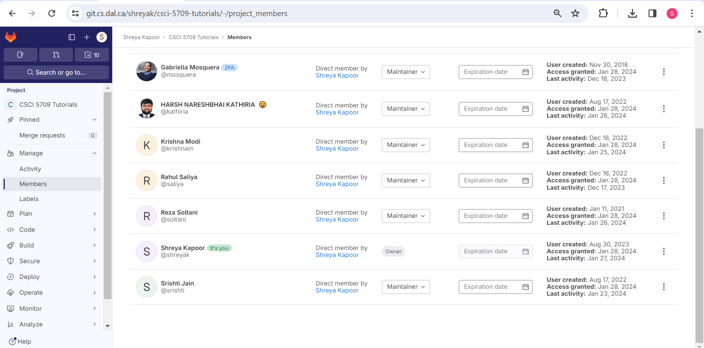

# Tutorial 2

* *Date Created*: 28.01.2024
* *Last Modification Date*: 28.01.2024
* *Tutorial 2 Gitlab URL*: [
CSCI 5709 Tutorial 2](https://git.cs.dal.ca/shreyak/csci-5709-tutorials/-/tree/main/tutorial2?ref_type=heads)

## Author

* [Shreya Kapoor](sh820878@dal.ca) - *(Maintainer)*

## Private Repositories Links

* Group Repository Link: [
CSCI 5709 Grp-14](https://git.cs.dal.ca/gosaliya/CSCI-5709-Grp-14)
* Assignment Repository Link: [
CSCI 5709 Assignments
](https://git.cs.dal.ca/shreyak/csci-5709-assignments)
* Tutorial Repository Link: [
CSCI 5709 Tutorials](https://git.cs.dal.ca/shreyak/csci-5709-tutorials)

#### Course Instructor and Teaching Assistants have been given the maintainers access to all the above three repositories.

## Group Repository Individual Branches
| Name           | Branch Link                           |
| -------------- | ------------------------------------- |
| Shreya Lapoor       | [shreya-branch](https://git.cs.dal.ca/gosaliya/CSCI-5709-Grp-14/-/tree/shreya-kapoor?ref_type=heads)       |
| Ramandeep Kaur     | [ramandeep-branch](https://git.cs.dal.ca/gosaliya/CSCI-5709-Grp-14/-/tree/feature-ramandeepkaur?ref_type=heads)       |
| Vishnu Narayanbhai Vasita   | [vishnu-branch](https://git.cs.dal.ca/gosaliya/CSCI-5709-Grp-14/-/tree/vishnu?ref_type=heads)       |
| Bhargav Kanodiya  | [bhargav-branch](https://git.cs.dal.ca/gosaliya/CSCI-5709-Grp-14/-/tree/Bhargav-Kanodiya?ref_type=heads)       |
| Jaskaran Singh   | [jaskaran-branch](https://git.cs.dal.ca/gosaliya/CSCI-5709-Grp-14/-/tree/jaskaran-singh?ref_type=heads)       |
| Dhrumil Vimalbhai Gosaliya   | [dhrumil-branch](https://git.cs.dal.ca/gosaliya/CSCI-5709-Grp-14/-/tree/dhrumil-gosaliya?ref_type=heads)       |

## Deployment

The application is deployed on [Netlify](https://app.netlify.com/sites/csci5709-shreya-reactapp/deploys)

* Deployment Link: https://csci5709-shreya-reactapp.netlify.app/

## Built With

* [React](https://legacy.reactjs.org/docs/getting-started.html) - The Javascript library used
* [Npm](https://docs.npmjs.com/) - A package manager
* [Node](https://nodejs.org/docs/latest/api/) - A javascript runtime environment
